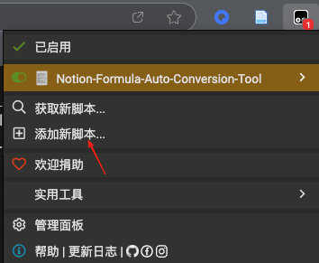
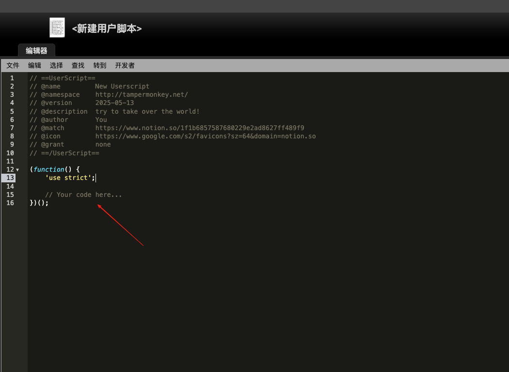
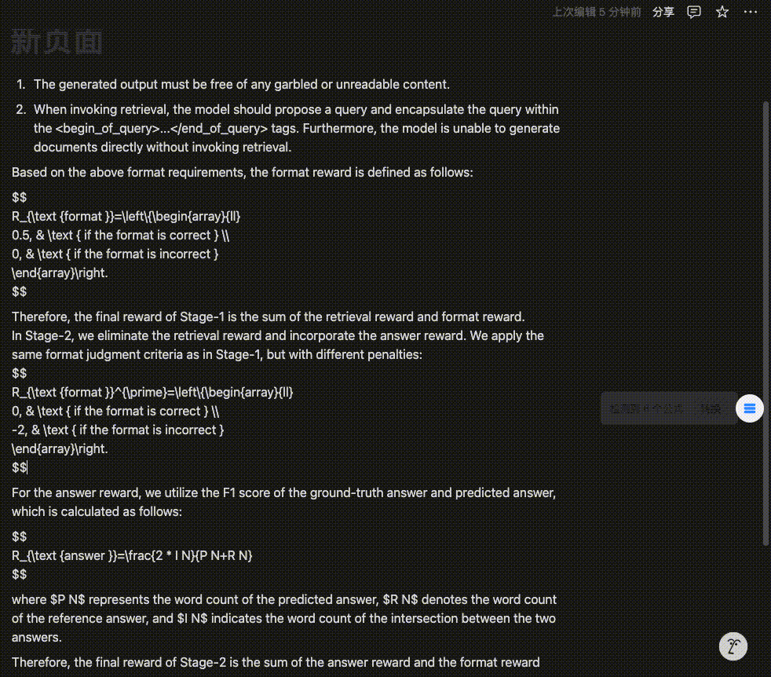

## notion公式转换

> 初始代码源自：https://github.com/skyance/Notion-Formula-Auto-Conversion-Tool

使用：

1. 安装油猴，并且打开开发者模式，chrome、edeg都可以（firefox应该也行，没测）

   

   粘贴`correct.js`代码

   

   `ctrl+s`保存

2. 点击转换

3. 尽量鼠标不离开该页面，脚本会自动调用转换公式按钮。

4. 仅仅支持转换为行内公式，支持`$$`和`$`，也就是说

```
$$
E=mc^2
$$
```

应该是
$$
E=mc^2
$$
但转换为

$$E=mc^2$$

6. 效果

   

> 提示：如果对于$$这样的block公式，如果不在一个区块，无法转换。

