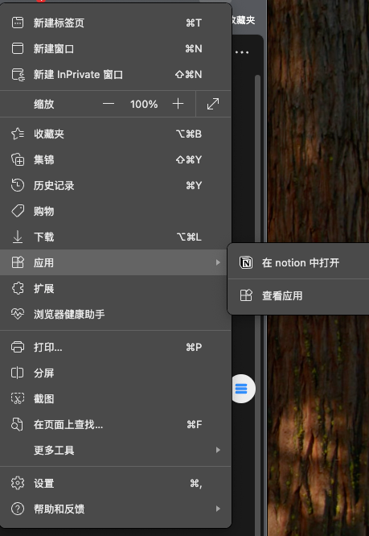

# Notion公式转换工具
如果是复制大模型的结果，推荐你先放到typora这样的markdown编辑器里作为中转，之后再放到notion里。
> 初始代码源自：https://github.com/skyance/Notion-Formula-Auto-Conversion-Tool

> 注意请保持你的下载是最新的
## 更新日志

### 2025年12月1日 - v1.99
- **修复表格内公式选中问题**

### 2025年11月7日 - v1.98
- **修复长公式问题**

### 2025年11月6日 - v1.93
- **修复内存泄露问题**

### 2025年11月6日 - v1.92
- **修复连续公式识别与转换**
  - 正确处理无空格分隔的连续公式（如 `$A\\$$B\\$$C\\$`）
  - 改为逐个转换模式，避免批量选择导致的内容丢失
  - 精确选中公式范围，不影响同一节点中的其他公式
  - 每次转换后自动重新扫描，确保严格按文档顺序处理
  - 实时显示剩余公式数量和转换进度

### 2025年10月21日 - v1.85
- **优化表格块内支持**
  - 解决表格中某些块无法转换的问题
  - 优化公式计数扫描

### 2025年10月20日 - v1.70
- **增强复杂长公式支持**
  - 优化超长公式（>500字符）的识别和转换
  - 实现分段输入机制，避免长公式截断
  - 自适应处理时间，根据公式复杂度动态调整

### 2025年10月20日 - v1.60
- **完整支持块级公式**
  - 正确识别并转换 `$$...$$` 为独立公式块
  - 智能区分内联公式 `$...$` 和块级公式
  - 优先处理块级公式，避免误判

### 2025年10月20日 - v1.50
- **修复新版Notion界面兼容性**
  - 适配Formula按钮从文本改为SVG图标
  - 支持 `squareRootSmall` 等新图标类名
  - 增强按钮识别的后备方案

### 2025年8月7日 - v1.40
- **修复了公式过长渲染分块导致自动转换失败的问题**
  - 问题原因：Notion编辑器会将长公式文本分割成多个`<span>`元素，导致脚本无法识别完整公式
  - 解决方案：改进了文本选择算法，支持跨节点文本识别和选择
  - 新增了文本聚合功能，能够正确处理被分割的公式文本

### 之前版本
- 添加了中途停止转换功能
- 优化了拖动响应速度
- 改进了悬浮球交互体验

## 功能特点

- 🔄 自动批量转换Markdown格式公式为Notion原生公式
- 📐 支持多种公式格式：`$$...$$`（块公式）、`$...$`（行内公式）、`\(...\)`、`\[...\]`
- 🎯 悬浮球界面，可拖动调整位置
- ⏹️ 支持中途停止转换
- 📊 实时显示转换进度
- 🔍 自动检测页面中的公式数量
- 🔁 智能逐个转换，避免内容丢失（v1.92+）

## 安装使用

### 1. 安装油猴插件

安装Tampermonkey浏览器扩展，并开启*开发者模式*（Chrome、Edge均支持，其中chrome还要在管理扩展程序/所有扩展程序/详情中开启*允许运行用户脚本*）


### 2. 添加脚本

1. 创建新脚本
2. 粘贴`correct.js`代码
3. `Ctrl+S`保存


### 3. 使用方法

1. 打开Notion页面，等待悬浮球出现
2. 鼠标悬停在悬浮球上查看检测到的公式数量
3. 点击"转换"按钮开始批量转换
4. 转换过程中尽量保持鼠标在页面内
5. 可点击"停止转换"中断操作

### 4. 效果展示


## 注意事项

### 公式格式支持

- ✅ 行内公式：`$E=mc^2$`
- ✅ 块公式：`$$E=mc^2$$`（v1.60+已完整支持）
- ✅ 连续公式：`$A\\$$B\\$$C\\$`（v1.92+已完整支持）
- ✅ LaTeX格式：`\(E=mc^2\)` 和 `\[E=mc^2\]`
- ✅ 复杂长公式：支持包含矩阵、积分、求和等复杂嵌套结构（v1.70+优化）

### 转换机制说明（v1.92+）

- **逐个转换**：脚本会按顺序逐个转换公式，而非批量处理
- **自动重扫描**：每转换一个公式后，会重新扫描页面获取最新状态
- **精确选择**：在包含多个公式的文本块中，只选中当前要转换的公式
- **实时反馈**：进度显示"已完成"和"剩余"数量

### 已知限制

1. **跨区块限制**：如果`$$`符号不在同一个文本块中，可能无法正确识别

2. **转换顺序**：严格按照公式在文档中的出现顺序转换（从上到下，从左到右）

3. **最大迭代**：单次转换最多处理100个公式，如超过需点击"继续转换"

## 进阶技巧

### 将Notion安装为应用

Edge和Chrome支持将网页转换为应用，可获得更好的使用体验：



### 查看详细日志

按 `F12` 打开浏览器控制台，可以看到详细的转换过程：
```
=== 开始逐个转换公式 ===

[第 1 次] 处理内联公式:
  剩余公式数: 3
  内容预览: \begin{aligned}...
  ✓ 转换成功

[第 2 次] 处理块级公式:
  剩余公式数: 2
  内容预览: E = mc^2
  ✓ 转换成功
```

## 故障排除

### 常见问题

1. **公式无法识别**
   - 确保公式格式正确（`$...$` 或 `$$...$$`）
   - 检查公式是否在同一文本块内
   - 尝试刷新页面后重试

2. **转换失败**
   - 查看控制台（F12）的错误信息
   - 某些复杂公式可能因包含特殊字符导致失败
   - 长公式已在v1.40版本修复，超长公式在v1.70进一步优化
   - 连续公式在v1.92已修复

3. **悬浮球不显示**
   - 确认油猴脚本已启用
   - 检查是否在Notion页面（URL包含notion.so）
   - 刷新页面

4. **部分公式被删除（v1.92已修复）**
   - 如使用旧版本，请更新至v1.92
   - 新版本采用逐个转换模式，不会丢失内容

5. **无法运行以及没有出现悬浮球 **
   - 开发者模式关闭再打开
   - 管理扩展程序/所有扩展程序/详情中开启*允许运行用户脚本*


## 反馈与贡献

如遇到问题或有改进建议，欢迎提交Issue或Pull Request。

